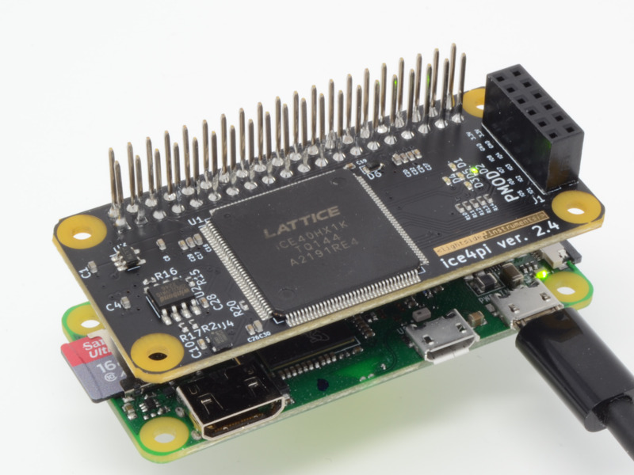

ice4pi Tutorial
=================


The ice4pi board is a Raspberry Pi shield that is
based on the design of the IceStick.



So ideally a bitstream and firmware for IceStick should work for ice4pi.

There are few exceptions (the IrDA transceiver is removed as well as the unpopulated side connectors).

It obviously has the additional 40-pin Raspberry Pi interface with all IOs connected to the FPGA. Which enables you to develop something useful.

The SPI Flash programming interface is connected to the Raspberry Pi interface. This allows you to reload and restart the logic on the shield.
The Serial TX/RX pins are connected to the Raspberry Pi interface too.

And you can edit the open-source KiCAD design and use the board as base for your own design.

This tutorial is short because it only document the differences between the ice4pi and IceStick boards.
And those are kept to a minimum intentionally.

In short for building the project you will use 'make ICE4PI'
instead of 'make ICESTICK'

For loading you would not use iceprog but a script based on the flashprog tool. The script is included TOOLS/ice4pi_prog

Here is the command sequence I use to build the SoC
and compile the hello C program. Then load them
to the shield.

```
make ICE4PI
cd FIRMWARE/EXAMPLES
make hello.spiflash.bin
cd ../../
sudo TOOLS/ice4pi_prog femtosoc.bin FIRMWARE/EXAMPLES/hello.spiflash.bin
```

There is one differences of significance in the BOM for the ice4pi-2.4-1:

1. The SPI flash chip used on IceStick is N25Q032A13ESC40F while the one used
on ice4pi-2.4-1 is W25Q32JVSNIQ


Now with this in mind you can go through the detailed [ICESTICK tutorial](ICESTICK.md) !
