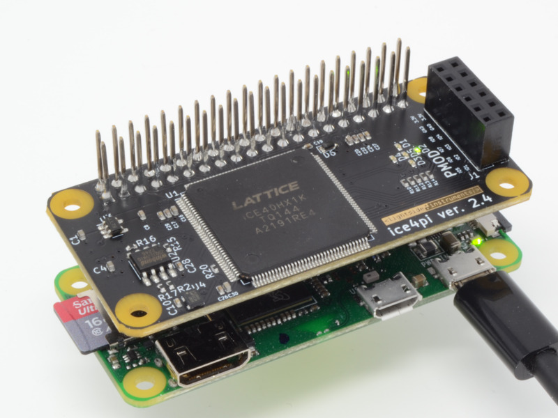

ice4pi Tutorial
=================



This tutorial is short because ice4pi board is identical
to IceStick in almost every aspect and bitstream
and binary code files built for IceStick will work on ice4pi
in the same way.

In short for building the project you will use 'make ICE4PI'
instead of 'make ICE4PI'


Here is the command sequence I use to build the Soc
and compile the hello C program. Then load them
to the shield.

```
make ICE4PI
cd FIRMWARE/EXAMPLES
make hello.spiflash.bin
cd ../../
sudo TOOLS/ice4pi_prog femtosoc.bin FIRMWARE/EXAMPLES/hello.spiflash.bin
```

In addition to the LEDs D1-D5 and PMOD pins that are connected to the same
set of IO pins,the ICE40HX1K is connected to the 40 pin Raspberry
Pi connector.

The serial port TX and RX pins are connecte to the Raspberry Pi header
instead of USB virtual serial device available on the IceStick.

There are 2 differences of significance:

1. The SPI flash chip used on IceStick is N25Q032A13ESC40F while the one used
on ice4pi-2.4-1 is W25Q32JVSNIQ

2. The flash chip on ice4pi is directly programmed over SPI from the connected
Raspberry Pi. Therefore a script is added TOOLS/ice4pi_prog


Now with this in mind you can go through the detailed [ICESTICK tutorial](ICESTICK.md) !
